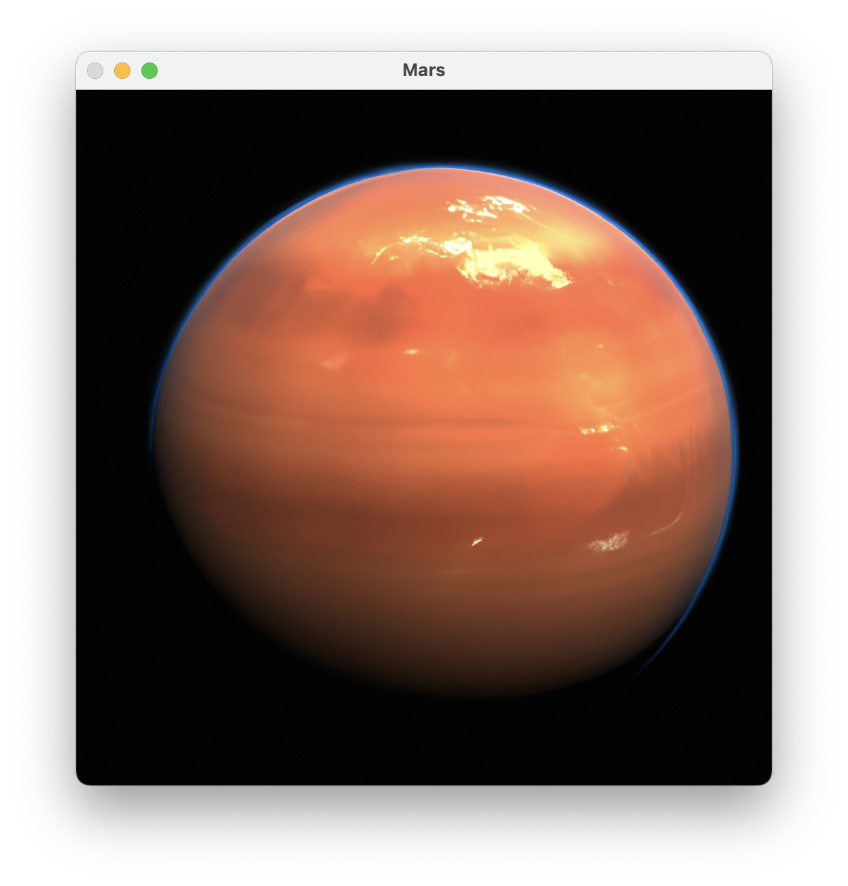

# Planets

A simple, minimal Python program that uses OpenAI's GPT-3.5 Turbo and DALL-E models to generate text and images for planets.



## Dependencies

- `openai`
- `opencv-python`

You can install these dependencies using pip:

```
pip3 install openai opencv-python
```

## API Key

You need to have your OpenAI API key for the program to work. This key should be entered at the top of the source code, replacing the "sk-xxxxxxxxxxxxxxxxxxxxxxxxxxxxxxxx" string with your actual API key:

```python
openai.api_key = "your-api-key-goes-here"
```

## Usage

The program is run by executing the Python file from your command line:

```
python3 planetinfo.py
```

By default, the program will display information and an image for Mars. If you wish to display information for a different planet, you will need to modify the following line in the `main` function:

```python
planet = "Saturn"
```

The program will print two sentences about the specified planet to the console, and also display a generated image of the planet. After displaying the image, the program will wait for any key to be pressed and then close the OpenCV window. The downloaded image file will be deleted after the OpenCV window is closed.

## Disclaimer

This program is not affiliated with or endorsed by OpenAI. Please use responsibly and adhere to OpenAI's use case policy.
